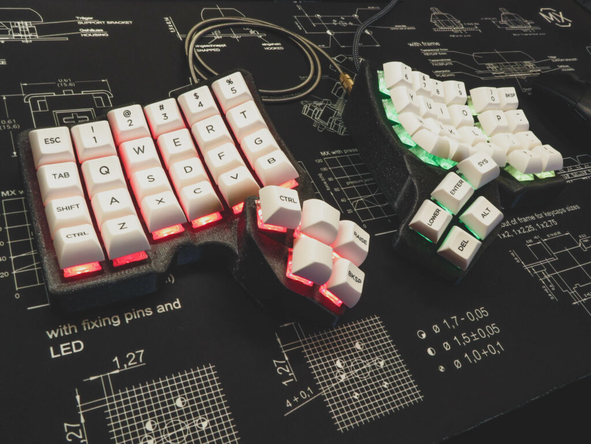

# Scylla

A modern low-profile ergonomic split keyboard, with a number row and a feature-full thumb cluster.

# Required components

## Electronic components

You will need to order the parts from a shop, and order some PCBs directly from the manufacturer.

Parts list:

| Part name                         | Amount | Link                                                                                       |
| --------------------------------- | ------ | ------------------------------------------------------------------------------------------ |
| Flexible PCB for the plate        | 2      | https://github.com/Bastardkb/Scylla-PCB-Plate                                              |
| Flexible PCB for the thumbs       | 2      | https://github.com/Bastardkb/Scylla-PCB-thumb-cluster                                      |
| Elite-C                           | 2      |                                                                                            |
| Elite-C adapter PCB V1.4          | 2      | https://github.com/Bastardkb/Elite-C-holder                                                |
| SOD123 Diodes                     | 10     |                                                                                            |
| BAT54C Diodes                     | 24     |                                                                                            |
| Cables                            |        | 28 AWG recommended                                                                         |
| M4 8mm Torx Screw                 | 16     | Conrad                                                                                     |
| M4 screw insert, M4 X D6.0 X L5.0 | 16     | https://fr.aliexpress.com/item/4000232925592.html?spm=a2g0s.12269583.0.0.6aef4f282LZO4v    |
| Audio jack, SMD                   | 2      |                                                                                            |
| Button, 4x4x1.5                   | 2      | https://www.aliexpress.com/item/1005001304569553.html?spm=a2g0s.9042311.0.0.27424c4dDwgcp7 |

If you don't want to source the Elite-C adapter PCB, you can use the [printable shield adapter](https://github.com/Bastardkb/Skeletyl/blob/main/things/pro%20micro%20mount%20plate/pro%20micro%20mount%20plate%20v2.stl).

If you don't want to source the flexible PCBs, you can also use either amoebas or handwire.

If you want RGB, you will also need:

| Part name          | Amount | Link       |
| ------------------ | ------ | ---------- |
| SK6812 Mini-E LEDs | 58     | Aliexpress |
| Capacitor, 1uF          | 4      | 1206                                  |
| Resistor, 330Ohms       | 4      | 1206                                  |
| Wires                   |        | 28 AWG recommended, Black, Red, Color |
| Ribbon cables Flexstrip | 6      |                                       |

## Print the case

The STL files are included in this Github.
Feel free to use and modify them at length. The files are on a non-commercial license, so this is for personal projects only - please do not use those to sell them.

Please find detailed instructions on how to print the case on the online instructions linked below.

### Tent mount plate
This option allows the keyboard to be mounted to standard camera gear tripods and mounts.  
A 1/4 - 20 UNC 7.6 mm deep heat insert is needed.  

## Get a kit from BastardKB

You can get a full Kit, including case and all PCBs and electronics required on the shop:
https://bastardkb.com/

If you want to print the case yourself, you can also get just the electronics Kit.

# Build guide

You can find detailed instruction on the online documentation linked below.

# Links

- Discord: https://bastardkb.com/discord
- Website: https://bastardkb.com/
- Docs: https://docs.bastardkb.com
# License 

This work is licensed under a Creative Commons Attribution-NonCommercial-ShareAlike 4.0 International License.
